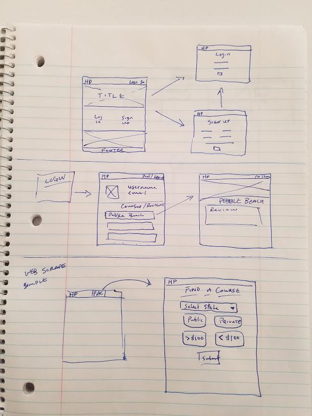
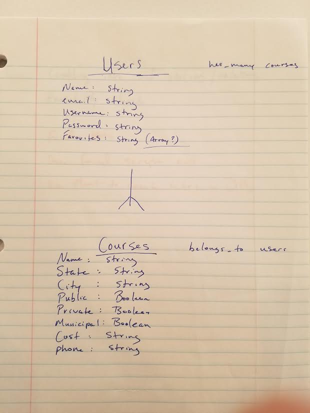

# README

# Pin-Seeker

## Project Description

The app that I developed is called Pin-Seeker. This is a mobile-friendly application
that allows anyone to use a search form to look for golf courses in their area. The
reasoning behind creating this app is that finding golf information is a tedious and
burdensome experience. I want to give users a quick solution to that problem. Let the
users look for exactly what type of course they want, and how to get in contact with
the Pro Shop.

## User Stories

This application appeals to anyone who has a passion for playing golf. Since finding
information about golf courses is difficult, this app will allow anyone to find a golf
course with ease. For example, if someone was traveling, but still had time to play a
round of golf. Navigating a new location is difficult enough. But what's more frustrating
is finding a course you want to play, only to find out that it is a private course, or costs
way more than you expected. Pin-Seeker works to eliminate these issues.

## Technologies Used

  - HTML
  - CSS
  - Ruby
  - Ruby on Rails
  - Javascript
  - Nokogiri
  - Materialize.scss

## Steps for Installation (Local)
  In the console...

  - bundle install
  - rails db:setup
  - rails server

## Code I'm Proud Of
``` ruby
<div class="row container">
  <%= form_tag({controller: "courses", action: "search"}, method: "get") do %>
  <h3>Select a City:</h3>
  <div class="input-field col s12">
    <%= select_tag(:city, options_for_select(@courses.map{ |c| [c.city]}.sort)) %>
  </div>
  <h3>Select a Course Type:</h3>
  <div class="input-field col s12">
    <%= check_box_tag(:public) %>
    <%= label_tag(:public, "Public Golf Course") %>
  </br>
  <%= check_box_tag(:private) %>
  <%= label_tag(:private, "Private Golf Course") %>
</br>
<%= check_box_tag(:municipal) %>
<%= label_tag(:municipal, "Municipal Golf Course") %>
</div>
<div class="input-field col s12 submit">
<%= submit_tag("Search Courses", class: "btn green darken-4") %>
<% end %>
```
``` ruby
def search
  @courses = Course.all
  if params[:city]
    @courses = Course.search(params[:city])
  else
    @courses = Course.all
  end
  puts params
end
```
``` ruby
course_page = Nokogiri::HTML(open("https://www.golfmax.com/Golf-Courses/New-Jersey-Golf-Courses.shtml"))
  courses = course_page.css('td a.navblue')
  names_array = []
  courses.map do |a|
    course_name = a.text
    names_array.push(course_name)
  end
```

## Wish List / Future Development
There is a lot that I was not able to complete in the first week working on this
project. Firstly, I was only able to incorporate all of the web scraped data into
my database. So my first step is trying to relate all of the web scraped data together.
Then what I want to do with this project is let users follow each other and develop
some functionality to let users store favorite courses and post their score cards. There
is a lot of development that can be added to the back end of this project, but having a
working search function is a great start.

## Wireframes



## Entity-Relationship Diagram


## Links
Heroku: https://mysterious-bastion-17458.herokuapp.com/
GitHub: https://github.com/ryanthomas92/golfApp
